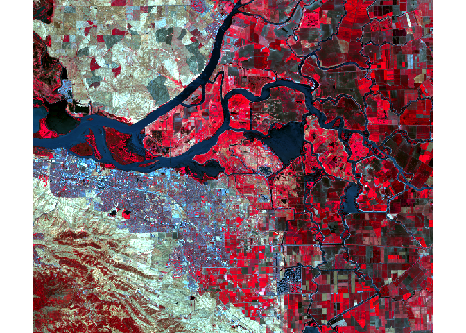

Landsat 8 Data with R and terra
================
Tucker Hindle
2022-08-07

Adapted from the original source: “Remote Sensing with terra” by
Aniruddha Ghosh and Robert J. Hijmans
(<https://rspatial.org/terra/rs/index.html>)

``` r
# Imports
library(terra)
```

    ## terra 1.5.21

## Get Data

Scene: `LC08_044034_20170614` is Landsat 8, Path 44, Row 34, collected
on June 14, 2017

``` r
dir.create("data", showWarnings=FALSE)
if (!file.exists("data/rs/samples.rds")) {
  download.file("https://biogeo.ucdavis.edu/data/rspatial/rs.zip", dest="data/rs.zip")
  unzip("data/rs.zip", exdir="data")
}
```

## Working with Landsat 8 Data

Landsat 8 band designations
(<https://www.usgs.gov/faqs/what-are-band-designations-landsat-satellites>).

Get the first 7 bands into a single `SpatRaster` object and rename each
using a human-readable alias.

``` r
filenames <- paste0("data/rs/LC08_044034_20170614_B", 1:7, ".tif")

r <- rast(filenames)

names(r) <- c("ultra-blue", "blue", "green", "red", "NIR", "SWIR1", "SWIR2")

r
```

    ## class       : SpatRaster 
    ## dimensions  : 1245, 1497, 7  (nrow, ncol, nlyr)
    ## resolution  : 30, 30  (x, y)
    ## extent      : 594090, 639000, 4190190, 4227540  (xmin, xmax, ymin, ymax)
    ## coord. ref. : WGS 84 / UTM zone 10N (EPSG:32610) 
    ## sources     : LC08_044034_20170614_B1.tif  
    ##               LC08_044034_20170614_B2.tif  
    ##               LC08_044034_20170614_B3.tif  
    ##               ... and 4 more source(s)
    ## names       :    ultra-blue,          blue,         green,           red,           NIR,         SWIR1, ... 
    ## min values  :  0.0964179114,  0.0748399049,  0.0425921641,  0.0208406653,  0.0008457669, -0.0078721829, ... 
    ## max values  :     0.7346282,     0.7177562,     0.6924697,     0.7861769,     1.0124315,     1.0432045, ...

The image properties confirm what is expected for a Landsat 8 image over
California: UTM projection Zone 10, 30-meter resolution, and 7 bands
(explicitly selected).

Note: properties can be accessed individually - e.g., `crs()`, `res()`,
`nlyr()`

A natural (true) color composite (red, green, and blue bands) can be
plotted by assigning its 4 3 2 band combination to the RGB channels.
Note: use linear stretch to increase contrast.

``` r
natural_color <- r[[c("red", "green", "blue")]]

plotRGB(natural_color, stretch="lin")
```

<!-- -->

A false color composite (near infrared, red, and green bands) can be
plotted by assigning its 5 4 3 band combination to the RGB channels.

``` r
false_color <- r[[c("NIR", "red", "green")]]

plotRGB(false_color, stretch="lin")
```

<!-- -->
